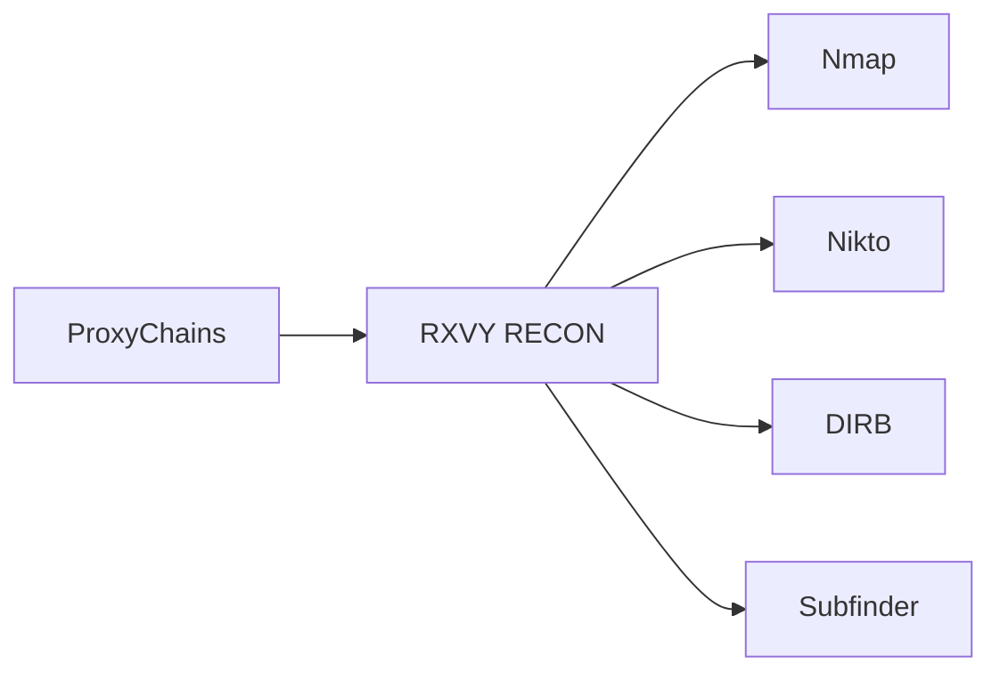
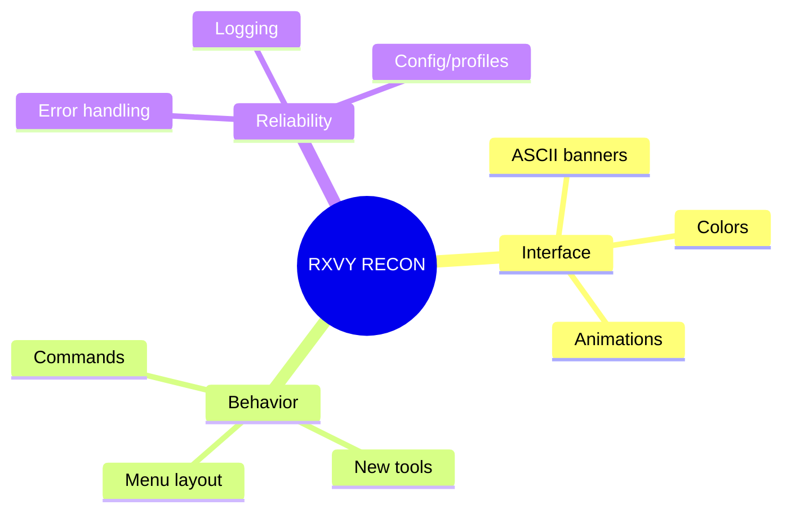

<div align="center">

```
 ██████╗ ██╗  ██╗██╗   ██╗██╗   ██╗    ██████╗ ███████╗ ██████╗ ██████╗ ███╗   ██╗
 ██╔══██╗╚██╗██╔╝██║   ██║╚██╗ ██╔╝    ██╔══██╗██╔════╝██╔════╝██╔═══██╗████╗  ██║
 ██████╔╝ ╚███╔╝ ██║   ██║ ╚████╔╝     ██████╔╝█████╗  ██║     ██║   ██║██╔██╗ ██║
 ██╔══██╗ ██╔██╗ ╚██╗ ██╔╝  ╚██╔╝      ██╔══██╗██╔══╝  ██║     ██║   ██║██║╚██╗██║
 ██║  ██║██╔╝ ██╗ ╚████╔╝    ██║       ██║  ██║███████╗╚██████╗╚██████╔╝██║ ╚████║
 ╚═╝  ╚═╝╚═╝  ╚═╝  ╚═══╝     ╚═╝       ╚═╝  ╚═╝╚══════╝ ╚═════╝ ╚═════╝ ╚═╝  ╚═══╝
```

### One terminal. Every recon tool you actually use.


[](#-requirements)
[](#-requirements)
[](#)
[](#-tools)
[](#%EF%B8%8F-legal)

<br>


<br><br>

**[Features](#-features)** ·
**[Tools](#-tools)** ·
**[Install](#-installation)** ·
**[Usage](#-usage)** ·
**[Tor & VPN](#-tor--vpn)** ·
**[Legal](#%EF%B8%8F-legal)** ·
**[Contributing](#-contributing)**

</div>

<br>

---

## ⚡ What is RXVY RECON?

**RXVY RECON** is a lightweight terminal control panel for the recon, OSINT, and security-testing tools you already use — so you stop memorizing flags and start picking numbers.

> Pick a tool → drop in a target → hit enter. That's the whole workflow.

Built for **CTFs**, home labs, security research, and **authorized** penetration testing.

<details>
<summary>📋 Plain-text menu (click to expand / copy)</summary>

```
                         RXVY-RECON v3.0
        ══════════════════════════════════════════════

        [1]  Nmap              Scan for open ports
        [2]  Nikto             Web server security scanner
        [3]  WHOIS             Domain / IP registration info
        [4]  FTP               Connect to FTP servers
        [5]  DIRB              Web directory enumeration
        [6]  Subfinder         Passive subdomain discovery
        [7]  Nmap -O           Operating-system detection

        [8]  Tor               Tor service / proxy management
        [9]  VPN Manager       Install and manage VPN options

        [10] Holehe            Check email account exposure
        [11] ZPhisher          Phishing simulation tool
        [12] Sherlock          Username OSINT

        [13] SQLMap            SQL injection testing
        [14] WPScan            WordPress security scanner

        [I]  Install Dependencies         [Q] Exit
```

</details>

<br>

---

## 🔥 Features

<table>
<tr>
<td width="33%" valign="top">

### 🖥️ Interface
- Interactive terminal menu
- Typing / reveal animations
- Colorized output
- Fully readable, no clutter

</td>
<td width="33%" valign="top">

### 🌐 Network & Privacy
- ProxyChains routing
- Tor enable / disable / restart
- VPN installer (Mullvad, Proton, Riseup)

</td>
<td width="33%" valign="top">

### 🛠️ Automation
- One-command dependency install
- BlackArch bootstrap support
- AUR (`yay`) package pulls
- Auto git-clone for extra tools

</td>
</tr>
</table>

| | |
|---|---|
| ✅ | Nmap port scanning **and** OS fingerprinting |
| ✅ | Web recon: Nikto, DIRB, Subfinder, WPScan |
| ✅ | OSINT: WHOIS, Holehe, Sherlock |
| ✅ | SQLMap injection wizard |
| ✅ | Phishing-awareness simulation (ZPhisher) |
| ✅ | Fully open, hackable source code |

<br>

---

## 🧰 Tools

<div align="center">

| # | Tool | Category | What it does |
|:-:|:--|:--|:--|
| 01 | 🛰️ **Nmap** | Network | Port & service scanning |
| 02 | 🕵️ **Nmap `-O`** | Network | Operating-system detection |
| 03 | 🌍 **Nikto** | Web | Web-server vulnerability scanning |
| 04 | 📇 **WHOIS** | OSINT | Domain / IP registration lookup |
| 05 | 📁 **FTP** | Network | FTP connections |
| 06 | 📂 **DIRB** | Web | Directory / path enumeration |
| 07 | 🔗 **Subfinder** | Recon | Passive subdomain discovery |
| 08 | 🧅 **Tor** | Anonymity | Enable / disable / restart the Tor service |
| 09 | 🔒 **VPN Manager** | Anonymity | Installs Mullvad, Proton VPN, or Riseup VPN |
| 10 | 📧 **Holehe** | OSINT | Checks which sites an email is registered on |
| 11 | 🎣 **ZPhisher** | Social Engineering | Phishing-page simulation for awareness testing |
| 12 | 🔎 **Sherlock** | OSINT | Username search across platforms |
| 13 | 💉 **SQLMap** | Web | Automated SQL injection testing |
| 14 | 🔧 **WPScan** | Web | WordPress vulnerability scanning |

</div>

> ⚠️ **ZPhisher** generates phishing-style login pages. Use it **only** for authorized security-awareness testing — e.g. your own org testing its employees with informed consent. Pointing it at real people without authorization is credential theft / fraud in most jurisdictions.

<br>

---

## 🖥️ Requirements

RXVY RECON targets **Arch Linux / BlackArch**.

<table>
<tr>
<td valign="top" width="33%">

**⚙️ Core**
- Python 3
- pacman
- sudo
- ProxyChains

</td>
<td valign="top" width="33%">

**📡 Recon (pacman)**
- nmap
- nikto
- whois
- inetutils
- dirb
- subfinder
- sqlmap
- python-requests

</td>
<td valign="top" width="33%">

**🧩 Optional (yay / manual)**
- holehe
- sherlock
- wpscan
- tor
- zphisher *(git-cloned)*
- BlackArch `strap.sh`

</td>
</tr>
</table>

> 💡 The `[I] Install Dependencies` menu option automates most of this: pacman packages → `yay` for `holehe`/`sherlock` → official BlackArch `strap.sh` bootstrap → git-clone of ZPhisher.
>
> ⚠️ `strap.sh` is downloaded and executed directly from blackarch.org **without** SHA256 verification in this tool. Review it yourself first if you want to confirm it hasn't been tampered with or corrupted in transit.

<br>

---

## 🚀 Installation

```bash
# 1. Clone the repository
git clone https://github.com/YOUR_USERNAME/rxvy-recon.git
cd rxvy-recon

# 2. Launch
python3 rxvyrecon.py

# 3. Inside the menu, install dependencies
Choose: I
```

<br>

---

## 🎯 Usage

```bash
python3 rxvyrecon.py
```

```text
Choose: 1
ip or url: scanme.nmap.org
```

RXVY RECON launches the matching tool with your input — that's the whole interaction loop.

<br>

---

## 🌐 ProxyChains

Several options route through ProxyChains. **Configure it before you use them.**



> ⚠️ ProxyChains or Tor does **not** make unauthorized activity legal, nor does it guarantee anonymity.

<br>

---

## 🧅 Tor & VPN

<table>
<tr>
<td valign="top" width="50%">

**TOR** — menu option `[8]`
```
1 = Enable
2 = Disable
3 = Restart
exit = back to main menu
```
Each action asks for a **y/n confirmation** before touching your system's Tor service.

</td>
<td valign="top" width="50%">

**VPN MANAGER** — menu option `[9]`
```
1 = Mullvad     (pacman)
2 = Proton VPN  (GUI or CLI, pacman)
3 = Riseup VPN  (AUR — needs yay)
exit = back to main menu
```

</td>
</tr>
</table>

<br>

---

## 🎨 Customization

The codebase is small on purpose — it's meant to be forked and bent into your own shape.



Adding a tool takes two lines: a menu entry and a `subprocess.run([...])` call.

<br>

---

## ⚠️ Legal

RXVY RECON is built for:

`CTFs` · `Cybersecurity education` · `Personal labs` · `Security research` · `Authorized penetration testing`

**Only test systems you own or have explicit permission to test.**

Do not use RXVY RECON to gain unauthorized access, attack systems, steal credentials, or disrupt services.

**ZPhisher specifically** must only be used against your own accounts/infrastructure, or as part of a sanctioned, consent-based phishing-awareness exercise. Using it against real third parties without authorization is illegal in most jurisdictions.

The author is not responsible for misuse of this project.

<br>

---

## 🤝 Contributing

<div align="center">

| 🐛 Bug found | 💡 Idea | 🛠️ New tool | 📖 Docs |
|:---:|:---:|:---:|:---:|
| [Open an issue](../../issues) | [Start a discussion](../../issues) | [Submit a PR](../../pulls) | [Improve the docs](../../pulls) |

</div>

<br>

---

<div align="center">

```
 ██████╗ ██╗  ██╗██╗   ██╗██╗   ██╗
 ██╔══██╗╚██╗██╔╝██║   ██║╚██╗ ██╔╝
 ██████╔╝ ╚███╔╝ ██║   ██║ ╚████╔╝
 ██╔══██╗ ██╔██╗ ╚██╗ ██╔╝  ╚██╔╝
 ██║  ██║██╔╝ ██╗ ╚████╔╝    ██║
 ╚═╝  ╚═╝╚═╝  ╚═╝  ╚═══╝     ╚═╝
```

**RECON • RESEARCH • LEARN • SECURE**

Created and maintained by **[rxvy](../../)**

⭐ **If this saved you time, star the repo — it actually helps.**

</div>
