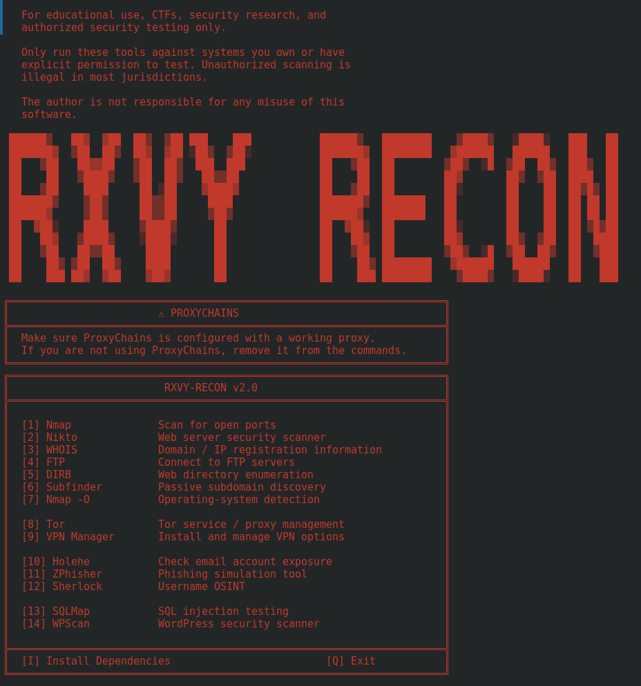
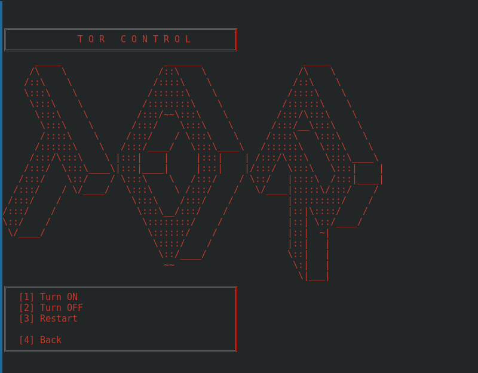
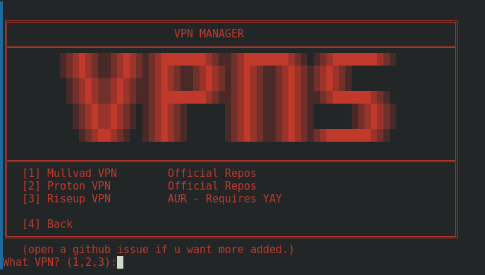
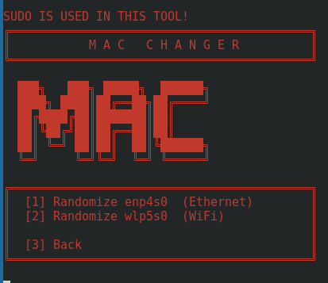

<div align="center">



</div>

```
============================================================
  rxvy-recon                                          v4.0
  open source · menu-driven · proxychains-first
============================================================
```

`rxvy-recon` collapses a dozen separate recon and security-testing
tools into one numbered menu. Pick a number, give it a target,
it runs — through ProxyChains, by default, every time.

No flags to memorize. No man pages mid-engagement. Just the menu.

---

## ▓▓ What it actually does

You run the script, you get a menu. You type a number, it asks
for a target if it needs one, and it launches the real tool —
`nmap`, `nikto`, `sqlmap`, whatever you picked — through
`proxychains`, in your terminal, with the real output. There's
no abstraction layer hiding what's happening; the menu is just
a faster way to type the command you'd type anyway.

Tor and VPN control live in the same menu, as submenus, so
switching your exit node doesn't mean tabbing away from the tool.

## ▓▓ Tools on the menu

```
  RECON & SCANNING          WEB TESTING           OSINT
  ─────────────────         ─────────────         ─────────────
  Nmap                      Nikto                 Holehe
  Nmap -O (OS detect)       SQLMap                Sherlock
  WHOIS                     WPScan
  Subfinder
  DIRB                      INFRASTRUCTURE        SOCIAL ENG.
                            ─────────────         ─────────────
  NETWORK UTILITIES         FTP                   ZPhisher
  ─────────────────         Tor Control
  MacChanger                VPN Manager
                            (Mullvad / Proton / Riseup)
```

15 tools, one entry point.

## ▓▓ Screenshots

<div align="center">

| Main Menu | Tor Control |
|:---:|:---:|
|  |  |

| VPN Manager | MacChanger |
|:---:|:---:|
|  |  |

</div>

## ▓▓ Requirements

- Linux — built and run on Arch / BlackArch
- Python 3
- `sudo` — needed for OS detection, MacChanger, and Tor service control
- [`yay`](https://github.com/Jguer/yay) — needed for the AUR packages (Holehe, Sherlock, Riseup VPN)

## ▓▓ Getting it running

**Let the tool install its own dependencies:**

```bash
python3 rxvyrecon.py
```

Choose `[I] Install Dependencies` from the main menu. It will,
in order:

1. Pull the core tools through `pacman` (Nmap, Nikto, WHOIS, DIRB, Subfinder, ProxyChains, SQLMap, MacChanger)
2. Pull AUR tools through `yay` (Holehe, Sherlock)
3. Fetch and run the BlackArch strap script
4. Clone [ZPhisher](https://github.com/htr-tech/zphisher)

> The BlackArch strap script's SHA256 is **not verified** here.
> It could theoretically be corrupted or spoofed in transit —
> read `strap.sh` yourself first if that matters to you.

**Or install everything by hand:**

```bash
sudo pacman -S nmap nikto whois inetutils dirb subfinder proxychains python-requests sqlmap macchanger
yay -S holehe sherlock
git clone --depth=1 https://github.com/htr-tech/zphisher.git
```

## ▓▓ Using it

```
$ python3 rxvyrecon.py
Choose: 1
ip or url: scanme.nmap.org
```

That's the entire interaction model. Number in, target in,
tool runs. Tor, VPN Manager, and MacChanger are submenus that
follow the same rhythm one level deeper.

## ▓▓ ProxyChains

Every scan command here is prefixed with `proxychains`. Before
you rely on it:

- Point `/etc/proxychains.conf` at a proxy that actually works
- Test the chain once outside the tool if you're not sure it's live
- If you don't want it at all, pull `proxychains` out of the relevant
  `subprocess.run([...])` line — it's a one-word edit per tool,
  there's no config flag to hunt for

## ▓▓ Menu reference

| # | Tool | Asks for | Notes |
|---|---|---|---|
| 1 | Nmap | ip or url | standard port scan |
| 2 | Nikto | ip or url | web server scan |
| 3 | WHOIS | website/url | domain / IP lookup |
| 4 | FTP | url | opens an FTP connection |
| 5 | DIRB | url | directory enumeration |
| 6 | Subfinder | website/url | passive subdomain discovery |
| 7 | Nmap `-O` | ip or url | OS detection — needs `sudo` |
| 8 | Tor | — | submenu: on / off / restart |
| 9 | VPN Manager | — | submenu: Mullvad / Proton / Riseup |
| 10 | Holehe | email | email exposure across sites |
| 11 | ZPhisher | — | launches the ZPhisher script |
| 12 | Sherlock | username(s) | username OSINT |
| 13 | SQLMap | — | launches the interactive wizard |
| 14 | WPScan | URL | WordPress security scan |
| 15 | MacChanger | — | submenu: randomize an interface — needs `sudo` |
| I | Install Dependencies | — | runs the full installer |
| Q | Exit | — | quits |

## ▓▓ Making it yours

The whole thing is one Python file with an if/elif chain — there's
no framework to learn before you can change something. Reasonable
places to start:

- Different ASCII banner, different color, different everything
- Add or drop tools from the menu
- New submenus in the same boxed style as Tor / VPN / MacChanger
- Real error handling for tools that aren't installed yet
- A log of what ran, against what target, when
- A config file for defaults — interface, wordlist, whether to use ProxyChains at all

## ▓▓ Not built yet

Ideas sitting on the shelf, if you want somewhere to start
contributing:

- **Proxy Manager** — view, edit, and test the ProxyChains config from inside the menu
- **Interface Manager** — detect real interfaces instead of the hardcoded `enp4s0` / `wlp5s0` in MacChanger
- **Scan log** — tool, target, timestamp, written somewhere you can review later
- **Dependency check** — see what's missing without running the full installer

## ▓▓ When something breaks

**"command not found" the moment you pick a tool**
It's not installed. Run `[I] Install Dependencies`, or grab that one tool by hand.

**MacChanger errors out or hits the wrong card**
`enp4s0` / `wlp5s0` are hardcoded to the original machine. Run `ip link show`, find your real interface names, drop them in.

**Nmap `-O` fails**
It needs `sudo` — the menu already runs it elevated, so check your user actually has sudo access.

**A scan just... hangs**
Almost always the proxy. Confirm ProxyChains is pointed at something that's actually up.

## ▓▓ Legal

Educational use, CTFs, security research, and authorized testing
only. **Only point these tools at systems you own or have explicit
permission to test.** Unauthorized scanning is illegal in most
places. None of this is on the author if you misuse it.

## ▓▓ Contributing

Fork it, break it, fix it, send a PR. Open an issue if you want
a tool added and don't want to build it yourself. If you add a
submenu, keep the boxed header + numbered options + a way back
to the main menu — that's the one convention worth keeping.

## ▓▓ Credits

Built and maintained by **rxvy**.

```
============================================================
  star the repo if it's useful to you. that's the whole ask.
============================================================
```
