# ⚡ rxvy-recon

A lightweight Python CLI for launching common cybersecurity and reconnaissance tools through ProxyChains.

**Created by rxvy · Version 3.0**



## In Action


## Overview

`rxvy-recon` wraps an arsenal of well-known reconnaissance, OSINT, and security-testing tools behind a fast, simple terminal menu. By defaulting to routing traffic through ProxyChains, it keeps your authorized recon work discreet. Instead of memorizing flags for tools like Nmap, Nikto, or SQLMap, pick a number and enter your target.

Built for fast, authorized security testing in CTF environments, homelabs, and pentest engagements.

## Included Tools

| Category | Tool | Purpose |
|---|---|---|
| Recon & Scanning | Nmap | Network and port scanning |
| | Nmap `-O` | OS detection (requires sudo) |
| | Nikto | Web server security scanner |
| | DIRB | Web directory enumeration |
| | Subfinder | Passive subdomain discovery |
| | FTP | FTP connections |
| | WHOIS | Domain registration lookups |
| OSINT | Holehe | Check email exposure across sites |
| | Sherlock | Cross-platform username OSINT |
| | ZPhisher | Phishing simulation tool |
| Vulnerability | SQLMap | Automated SQL injection testing |
| | WPScan | WordPress security scanner |
| Infra | Tor | Enable/disable/restart Tor service |
| | VPN Manager | Install Mullvad, Proton VPN, or Riseup VPN |

## Features

- 🔧 Built-in dependency installer for Arch Linux / BlackArch
- 🧅 Tor service management straight from the CLI
- 🔐 Quick-install VPN options (Mullvad, Proton, Riseup)
- 🖥️ Interactive terminal menu with typing animations
- 🔗 ProxyChains-native — external scans route through it by default

## Requirements

- Arch Linux ecosystem
- Python 3
- ProxyChains, configured and connected to a working proxy
- `yay`, for AUR packages (Riseup VPN, some OSINT tools)
- Tool dependencies: Nmap, Nikto, inetutils (WHOIS), DIRB, Subfinder, Holehe, Sherlock, SQLMap, WPScan, ZPhisher

> **Note on the install menu:** `[I]` pulls packages via `pacman`/`yay` and also downloads and runs BlackArch's `strap.sh` as root. That script's integrity isn't verified locally via checksum — check BlackArch's official docs if you'd rather verify and run it manually.

## Installation & Usage

```bash
python3 rxvyrecon.py
```

If you're missing dependencies, launch the script and pick `I` from the main menu.

Then pick a numbered option and give it a target:

```
Choose: 1
ip or url: scanme.nmap.org
```

If you don't want ProxyChains, edit `rxvyrecon.py` and remove the `proxychains` string from the relevant `subprocess.run` arrays.

## Legal & Ethical Use

For educational use, CTFs, security research, and authorized security testing only.

- Only run these tools against systems you own or have explicit written permission to test.
- Do not scan or test websites, networks, servers, or devices without authorization.
- Unauthorized scanning is illegal in most jurisdictions.
- The author is not responsible for any misuse of this software.

## Contributing

Open source — forks, pull requests, and improvements are welcome.

---

⭐ If you find `rxvy-recon` useful, consider starring the repo.
